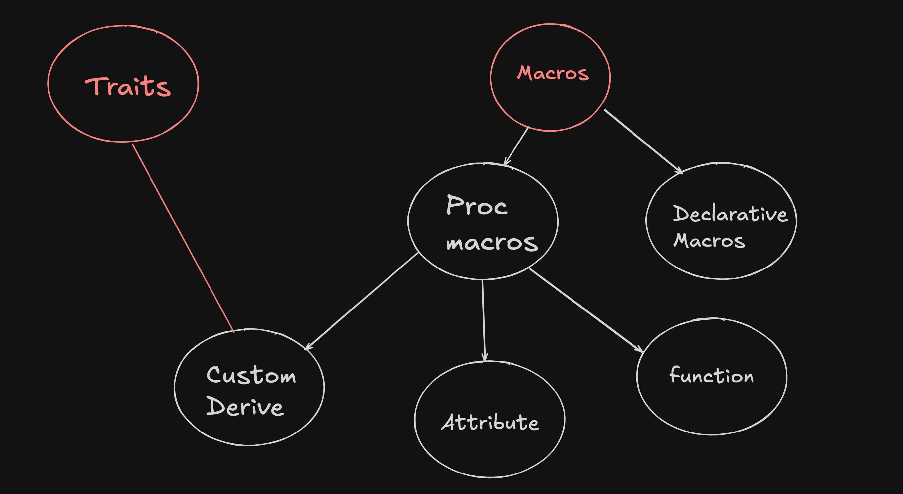

# 🦀 Rust Macro Playground

This repository is a **learning playground** for Rust macros. It explores all four types of macros in Rust with simple, practical examples.

📂 The **main file** of this project is [`main.rs`](./main.rs) – this is where you’ll find the entry point running core examples.  
📁 Other folders contain **individual examples and learnings** about each macro type.

---

## 📸 Overview

  
*A visual overview of Rust macro types (declarative and procedural)*

---

## 🚀 Macro Types Covered

Rust macros are powerful metaprogramming tools. They are broadly divided into **two categories**:  

### 1️⃣ Declarative Macros (a.k.a. Macros by Example)
- Syntax: `macro_rules!`
- Example:  
  ```rust
  println!("Hello, world!"); // Declarative macro


# ⚡ Procedural Macros in Rust

This section explores **procedural macros** – powerful tools in Rust that allow code generation at compile time by operating directly on the Abstract Syntax Tree (AST).  

Procedural macros are divided into three subtypes:  

- 🪞 **Custom Derive Macros**
- 🏷️ **Attribute-like Macros**
- ⚡ **Function-like Macros**

📂 This folder contains examples for each subtype, along with explanations and usage.

---

## 🪞 Custom Derive Macros

Custom derive macros allow you to automatically implement traits for your types.  

Example:  
```rust
#[derive(Debug)] // Debug is a custom derive proc macro
// It automatically implements the Debug trait for the User struct.
struct User {
    name: String,
    age: u32,
}

fn main() {
    let user = User {
        name: String::from("Subhajit"),
        age: 25,
    };
    println!("{:?}", user); // Declarative macro (println!)
}
```

For better understanding, Read this article: [Rust Derive Macros](
    https://medium.com/@praptii/traits-and-macros-in-rust-the-complete-beginner-to-advanced-guide-49426e97019f
)